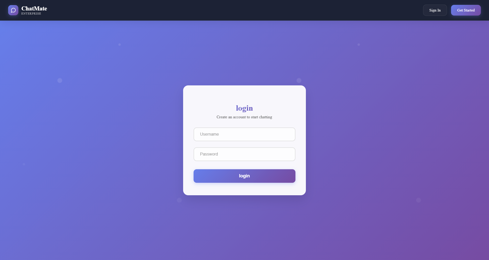
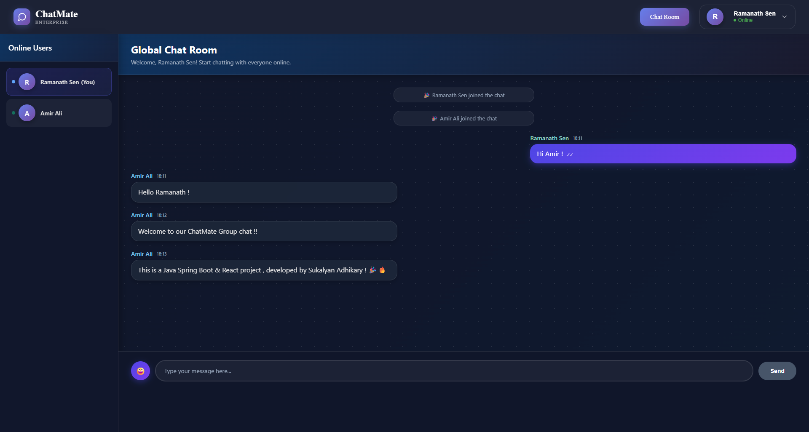
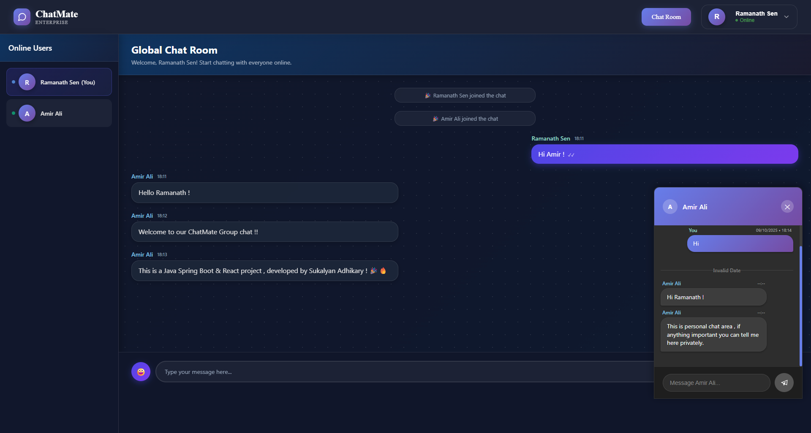
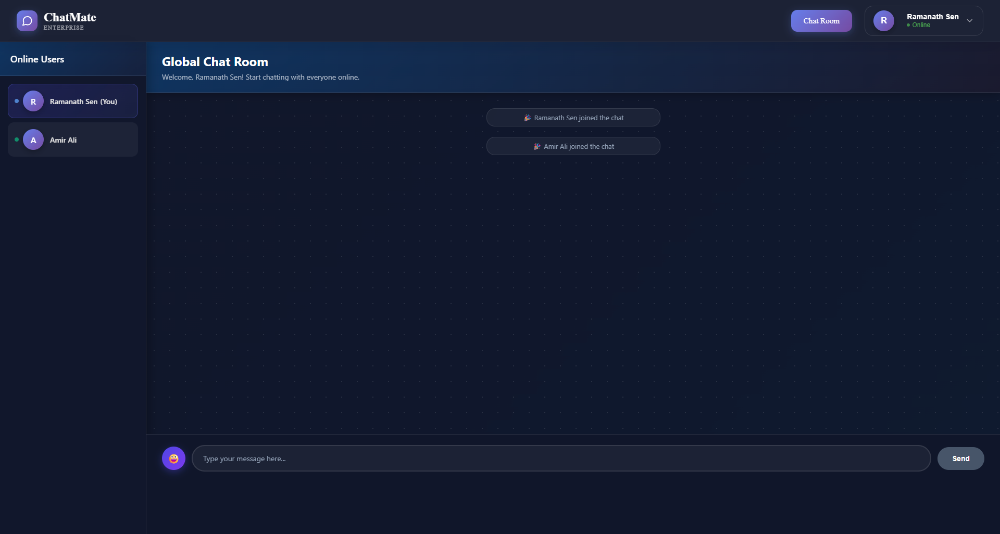
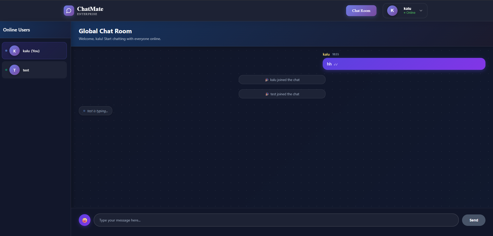
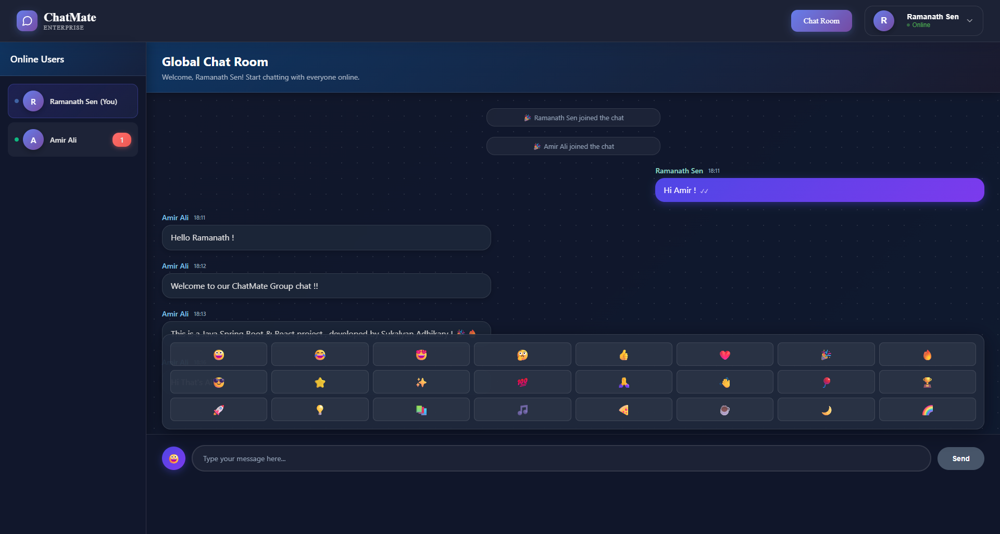
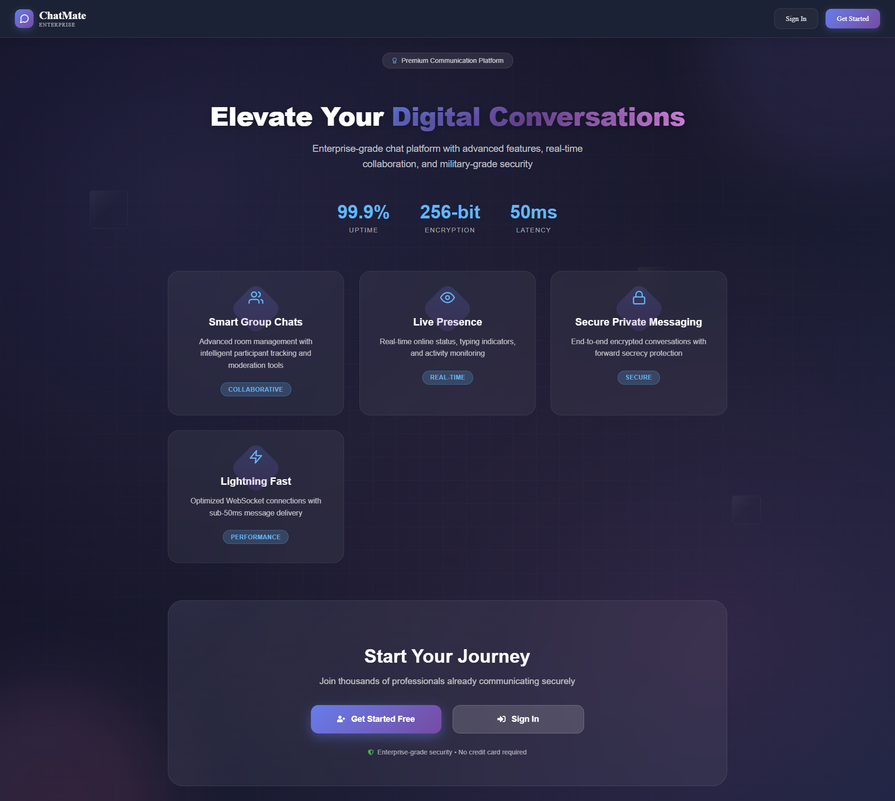

<!DOCTYPE html>
<html lang="en">
<head>
  <meta charset="UTF-8">
  <meta name="viewport" content="width=device-width, initial-scale=1.0">
  
</head>
<body>
  <h1> ChatMate – A Real-Time Chat Application</h1>
  

    <strong>ChatMate</strong> is a real-time chat application built with 
    <strong>Spring Boot</strong>, <strong>WebSocket (STOMP)</strong>, 
    <strong>Spring Messaging</strong>, and <strong>React.js</strong>.  
    It allows users to join a <strong>public chat room</strong>, send 
    <strong>private messages</strong>, and manage their 
    <strong>online/offline status seamlessly</strong>.
  

  <h2>📑 Table of Contents</h2>
  <ul>
    <li><a href="#features">Features</a></li>
    <li><a href="#tech-stack">Tech Stack</a></li>
    <li><a href="#project-structure">Project Structure</a></li>
    <li><a href="#screenshots">Screenshots</a></li>
    <li><a href="#demo">Demo Video</a></li>
    <li><a href="#usage">Usage</a></li>
    <li><a href="#examples">Examples</a></li>
    <li><a href="#troubleshooting">Troubleshooting</a></li>
    <li><a href="#contributors">Contributors</a></li>
    <li><a href="#license">License</a></li>
  </ul>

  <h2 id="features">✨ Features</h2>
  <ul>
    <li> Real-time messaging using WebSocket (STOMP protocol)</li>
    <li> Public chat room for group discussions</li>
    <li> Private messaging between users</li>
    <li> Online/Offline status tracking</li>
    <li> User-friendly React.js frontend</li>
    <li> Notification of user join/leave events</li>
    <li> See when others are typing</li>
    <li> Send Emojis </li>
    <li> Spring Boot backend with scalable architecture</li>
  </ul>

  <h2 id="tech-stack">🛠 Tech Stack</h2>
  
  <h3>Backend (Spring Boot)</h3>
  <ul>
    <li>☕ Java 17 – Primary programming language</li>
    <li>🚀 Spring Boot 3.x – Application framework</li>
    <li>🔐 Spring Security – Authentication and authorization</li>
    <li>🗄 Spring Data JPA – Database abstraction layer</li>
    <li>🔌 WebSocket – Real-time bidirectional communication</li>
    <li>🔑 JWT – JSON Web Tokens for stateless authentication</li>
    <li>📦 Maven – Dependency management and build tool</li>
    <li>📡 WebSTOMP & Spring Messaging – Real-time messaging</li>
  </ul>

  <h3>Database</h3>
  <ul>
    <li>🐬 MySQL – Primary relational database for production</li>
    <li>🧪 H2 Database – In-memory database for testing</li>
  </ul>

  <h3>Frontend (Based on project structure)</h3>
  <ul>
    <li>⚛️ React.js – Frontend framework</li>
    <li>📜 JavaScript – Type-safe JavaScript development</li>
    <li>🔌 WebSocket Client – Real-time communication</li>
    <li>🌐 REST API Integration – HTTP client for API calls</li>
  </ul>

  <h3>DevOps & Tools</h3>
  <ul>
    <li>🐳 Docker – Containerization</li>
    <li>🧪 Spring Boot Test – Integration testing</li>
    <li>✂️ Lombok – Reduced boilerplate code</li>
    <li>📂 Git & GitHub – Version control</li>
  </ul>

  <h2 id="project-structure">📂 Project Structure</h2>
  <pre>
ChatMate-A-Real-Time-Chat-Application/
│── backend/       # Spring Boot backend (WebSocket, messaging, REST APIs)
│── frontend/      # React.js frontend (UI components, chat interface)
│── README.md      # Project documentation
  </pre>

  <h2 id="screenshots">📸 Screenshots</h2>
  
  

    

      
      

        <strong>Login Page:</strong> User authentication interface
      

    

    

      
      

        <strong>Public Chat Room:</strong> Group conversation interface
      

    

    

      
      

        <strong>Private Messaging:</strong> One-on-one conversation view
      

    

    

      
      

        <strong>User List:</strong> Shows online/offline status of all users
      

    

    

      
      

        <strong>Typing Indicator:</strong> Shows when someone is typing
      

    

    

      
      

        <strong>Emoji Picker:</strong> Easy emoji selection interface
      

    

    

      
      

        <strong>Main Page View :</strong> Showcase before login or signup page.
      

    

  

  <h2 id="usage">▶️ Usage</h2>
  <ol>
    <li>Start the <strong>backend</strong> server.</li>
    <li>Start the <strong>frontend</strong> application.</li>
    <li>Open the app in your browser and:
      <ul>
        <li>Join the <strong>public chat room</strong></li>
        <li>Send <strong>private messages</strong> to specific users</li>
        <li>See who's <strong>online/offline</strong></li>
      </ul>
    </li>
  </ol>

  <h2 id="examples">💡 Examples</h2>
  <ul>
    <li><strong>Public Chat</strong>: Multiple users join and see all messages in real time.</li>
    <li><strong>Private Messaging</strong>: Send a direct message to another user using their username.</li>
    <li><strong>Status Tracking</strong>: Instantly see when a user comes online or goes offline.</li>
  </ul>

  <h2 id="troubleshooting">🐞 Troubleshooting</h2>
  <ul>
    <li>If WebSocket doesn't connect, check backend server logs.</li>
    <li>Ensure <strong>backend runs on port 8080</strong> and frontend connects correctly.</li>
    <li>Run <code>npm install</code> again if frontend dependencies fail.</li>
  </ul>

  <h2 id="contributors">👨‍💻 Contributors</h2>
  <ul>
    <li><a href="https://github.com/SAdhikary2">SAdhikary2</a> – Creator & Developer</li>
  </ul>

  <h2 id="license">📜 License</h2>
  

    This project is licensed under the <strong>MIT License</strong> 
  

  
  <a href="#" class="back-to-top">↑ Back to top</a>
</body>
</html>